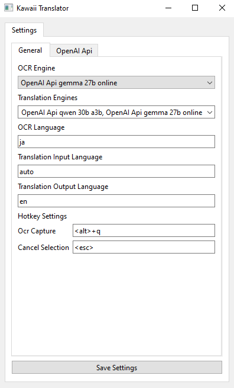
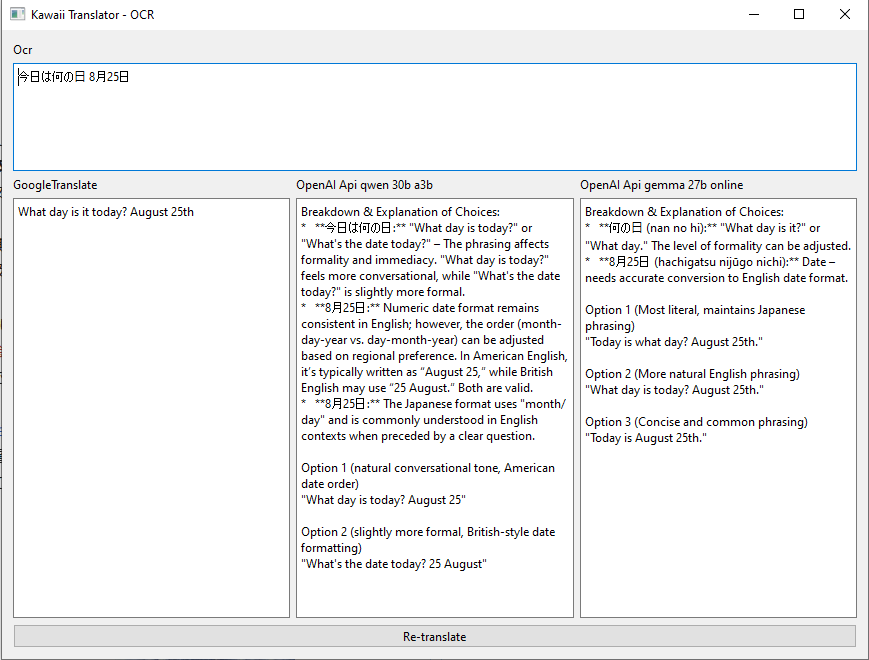

# Kawaii Translator

Small GUI program allowing for quick OCR with hotkeys and translation of text.




## Installation

You can install Kawaii Translator using pip:

```
git clone https://github.com/Hypi122/Kawaii-Translator
cd ./Kawaii-Translator
pip install .[all] 
```

### Supported engines

#### OCR Engines
- **[MangaOCR](https://github.com/kha-white/manga-ocr)**:
  `pip install .[manga_ocr]`
- **[OpenAI Compatible](https://github.com/openai/openai-python)**:
  `pip install .[openai]`
- **[PaddleOCR](https://github.com/PaddlePaddle/PaddleOCR)** (CPU version):
  `pip install .[paddle_ocr_cpu]`
- **[Windows OCR](https://learn.microsoft.com/en-us/uwp/api/windows.media.ocr)** ([winocr](https://github.com/GitHub30/winocr)):
  `pip install .[windows_ocr]`

#### Translation Engines
- **[OpenAI Compatible](https://github.com/openai/openai-python)**:
  `pip install .[openai]`
- **[Google Translate](https://translate.google.com)** ([py-googletrans](https://github.com/ssut/py-googletrans)):
  `pip install .[google_translate]`

#### Bulk Installation
- All OCR engines:
  `pip install .[all_ocr]`
- All translation engines:
  `pip install .[all_translation]`
- Combined installation (example):
  `pip install .[manga_ocr,openai,google_translate]`

## Usage
You can run Kawaii Translator using:

`python .\src\main.py`

## Tested On

This project has been tested on Python versions 3.13.6 and 3.9.7.

## Description

Built using:
*   **GUI:** PyQt6
*   **Screenshot Handling:** Pillow, NumPy, OpenCV
*   **Hotkeys:** Pynput

## TODO

*   Better setting up hotkeys
*   General gui improvements
*   Paddle OCR support gpu inference
*   System tray
*   Ability to add custom context in ocr window for LLM translator

## Known issues
*   Text on checkable combo box for translation engines sometimes gets desynced (when you click on it, it shows correct values, just not on the "main" text)